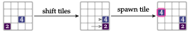

# 2048

## Problem

The 2048 problem is based on a popular tile game.

## States, Actions and Transitions
It has discrete state and action spaces. The game is played on a 4 × 4 board. The board is initially empty except
for two tiles, each of which can have value 2 or 4. A randomly selected starting state is shown in the figure below.

The agent can move all tiles left, down, right, or up. Choosing a direction pushes all tiles in that direction. A tile stops when it hits a wall or another tile of a different value. A tile that hits another tile of the same value merges with that tile, forming a new tile with their combined value. After shifting and merging, a new tile of value 2 or 4 is spawned in a random open space. This process is shown in the figure below.

## Reward Functions and Termination
The game ends when we can no longer shift tiles to produce an empty space. Rewards are only obtained when merging two tiles and are equal to the merge tile’s value. An example state-action transition with a merge is shown in figure below.

## Optimal Policies
A common strategy is to choose a corner and alternate between the two actions that lead in that direction. This tends to stratify the tiles such that the larger-valued ones are in the corner and the newly spawned tiles are in the periphery.
