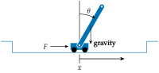

# Cart-Pole

## Problem

The cart-pole problem, also sometimes called the pole balancing problem, has the agent move a cart back and forth. As shown in the figure below, this cart has a rigid pole attached to it by a swivel, such that as the cart moves back and forth, the pole begins to rotate. The objective is to the keep the pole vertically balanced while keeping the cart near within the allowed lateral bounds.



## State and Action Space

The actions are to either apply a left or right force ``F`` on the cart. The state space is defined by four continuous variables: the lateral position of the cart ``x``, its lateral velocity ``v``, the angle of the pole ``\theta``, and the pole’s angular velocity ``\omega``. The problem involves a variety of parameters including the mass of the cart ``m_{\text{cart}}``, the mass of the pole ``m_{\text{pole}}``, the pole length ``\ell``, the force magnitude ``|F|``, gravitational acceleration ``g``, the timestep ``\Delta t``, the maximum ``x`` deviation, the maximum angular
deviation, and friction losses between the cart and pole or between the cart and its track.

The cart-pole problem is typically initialized with each random value drawn from ``\mathcal{U}(-0.05, 0.05)``.

## Transitions
Given an input force ``F``, the angular acceleration on the pole is

```math
\alpha = \frac{g \sin(\theta) - \tau \cos(\theta)}{\frac{\ell}{2} \left(\frac{4}{3} - \frac{m_{\text{pole}}}{m_{\text{cart}} + m_{\text{pole}}} \cos(\theta)^2\right)}
```
where
```math
\begin{aligned}
\tau = \frac{F + \omega^2 \ell \sin(\theta/2)}{m_{\text{cart}} + m_{\text{pole}}}.
\end{aligned}
```
The lateral cart acceleration is
```math
\begin{aligned}
a = \tau - \frac{\ell}{2} \alpha \cos(\theta) \frac{m_{\text{pole}}}{m_{\text{cart}} + m_{\text{pole}}}.
\end{aligned}
```
The state is updated with Euler integration:
```math
\begin{aligned}
x &\rightarrow x + v \Delta t \\
v &\rightarrow v + a \Delta t \\
\theta &\rightarrow \theta + \omega \Delta t \\
\omega &\rightarrow \omega + \alpha \Delta t.  
\end{aligned}
```

## Reward and Termination Condition
Since the objective is to the keep the pole vertically balanced while keeping the cart near within the allowed lateral bounds, 1 reward is obtained each time step in which these conditions are met, and transition to a terminal zero-reward state occurs whenever they are not.
