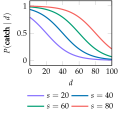

# Catch

## Problem

In the catch problem, Johnny would like to successfully catch throws from his father, and he prefers catching longer-distance throws. However, he is uncertain about the relationship between the distances of a throw and the probability of a successful catch. He does know that the probability of a successful catch is the same regardless of whether he is throwing or catching, and he has a finite number of attempted catches to maximize his expected utility before he has to go home.

As shown in the figure below, Johnny models the probability of successfully catching a ball thrown a distance ``d`` as
```math
P(\text{catch} \mid d) = 1 - \frac{1}{1 + \text{exp}(-\frac{d-s}{15})}
```
where the proficiency ``s`` is unknown and does not change over time. To keep things
manageable, he assumes ``s`` belongs to the discrete set ``\mathcal{S} = {20, 40, 60, 80}``.



## Reward and Action Space
The reward for a successful catch is equal to the distance. If the catch is unsuccessful, then the reward is zero. Johnny wants to maximize the reward over a finite number of attempted throws. With each throw, Johnny chooses a distance from
a discrete set ``\mathcal{A} = \{10, 20, \dots, 100\}``. Johnny begins with a uniform distribution
over ``\mathcal{S}``.
