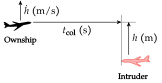
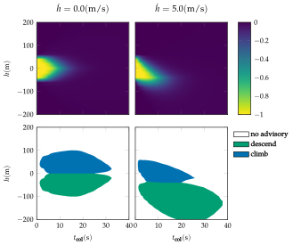

# Aircraft Collision Avoidance

## Problem

The aircraft collision avoidance problem involves deciding when to issue a climb or descend advisory to our aircraft to avoid an intruder aircraft. The figure below illustrates the problem scene.



## State and Action Space
There are three actions corresponding to no advisory, commanding a ``5 \text{ m/s}`` descend, and commanding a ``5 \text{ m/s}`` climb. The intruder is approaching us head-on with constant horizontal closing speed. The state is specified by the altitude ``h`` of our aircraft measured relative to the intruder aircraft, our vertical rate ˙``h``, the previous action ``a_{\text{prev}}``, and the time to potential collision ``t_{\text{col}}``.

## Transitions
Given action ``a``, the state variables are updated as follows:
```math
\begin{aligned}
h &\rightarrow h + h \Delta t \\
h &\rightarrow (h + v)\Delta t \\
a_{\text{prev}} &\rightarrow a \\
t_{\text{col}} &\rightarrow t_{\text{col}} - \Delta t
\end{aligned}
```
where ``\Delta t = 1 \text{ s}`` and ``v`` is selected from a discrete distribution over ``-2, 0,`` or ``2 \text{m/s}^2`` with associated probabilities ``0.25, 0.5, 0.25``. The value ``h`` is given by
```math
h = \begin{cases} 0 & \text{if } a = \text{ no advisory} \\ a/\Delta t & \text{if } |a - h|/\Delta t < h_{\text{limit}} \\ \text{sign}(a - h)h_{\text{limit}} & \text{otherwise} \end{cases}
```
where ``h_{\text{limit}} = 1 \text{m/s}^2``.

## Reward and Termination Condition
The episode terminates when taking an action when ``t_{\text{col}} < 0``. There is a penalty of ``1`` when the intruder comes within ``50`` m when ``t_{\text{col}} = 0``, and there is a penalty of ``0.01`` when ``a \neq a_{\text{prev}}``.

## Strategies
The aircraft collision avoidance problem can be efficiently solved over a discretized grid using backwards induction value iteration (Section 7.6 of Algorithms for Decision Making) because the dynamics deterministically reduce ``t_{\text{col}}``. Slices of the optimal value function and policy are depicted below.


