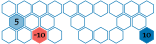

# Hex World

## Problem

The hex world problem is a simple MDP in which we must traverse a tile map to reach a goal state.

## State Space, Action Space and Transitions

Each cell in the tile map represents a state in the MDP. We can attempt to move in any of the ``6`` directions. The effects of these actions are stochastic. As shown in the figure below, we move ``1`` step in the specified direction with probability ``0.7``, and we move ``1`` step in one of the neighboring directions, each with probability ``0.15``. If we bump against the outer border of the grid, then we do not move at all, at cost ``1.0``.

## Reward and Termination Condition
Certain cells in the hex world problem are terminal states. Taking any action in these cells gives us a specified reward and then transports us to a terminal state. No further reward is received in the terminal state. The total number of states in the hex world problem is thus the number of tiles plus ``1``, for the terminal state.

## Optimal Policies
The figure below shows an optimal policy for two hex world problem configurations.

