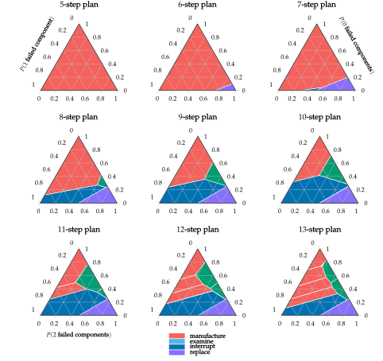
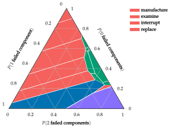

# Machine Replacement

## Problem

The machine replacement problem is a discrete POMDP in which we maintain a machine that produces products. This problem is used for its relative simplicity and the varied size and shape of the optimal policy regions.

The machine produces products for us when it is working properly. Over time, the two primary components in the machine may break down, together or individually, leading to defective product. We can indirectly observe whether the machine is faulty by examining the products, or by directly examining the components in the machine.

## State, Action and Observation Space
The problem has states ``\mathcal{S} = \{0, 1, 2\}``, corresponding to the number of faulty
internal components. There are four actions, used prior to each production cycle:
1. manufacture, manufacture product and do not examine the product,
2. examine, manufacture product and examine the product,
3. interrupt, interrupt production, inspect, and replace failed components, and
4. replace replace both components after interrupting production.

When we examine the product, we can observe whether or not it is defective.
All other actions only observe non-defective products.

## Transitions, Reward and Observation Functions
The components in the machine independently have a ``10 \%`` chance of breaking down with each production cycle. Each failed component contributes a ``50 \%`` chance of producing a defective product. A nondefective product nets ``1`` reward, whereas a defective product nets ``0`` reward. The transition dynamics assume that component breakdown is determined before a product is made, so the manufacture action on a fully-functional machine does not have a ``100 \%`` chance of producing ``1`` reward.

The manufacture action incurs no penalty. Examining the product costs ``0.25``. Interrupting the line costs ``0.5`` to inspect the machine, causes no product to be produced, and incurs ``1`` for each broken component. Simply replacing both components always incurs 2, but does not have an inspection cost.

The transition, observation, and reward functions are given in the table below.

## Optimal Policies
Optimal policies for increasing horizons are shown in the figures below:

