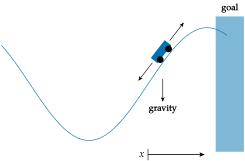

# Mountain Car

## Problem

In the mountain car problem, a vehicle must drive to the right, out of a valley. The valley walls are steep enough that blindly accelerating toward the goal with insufficient speed causes the vehicle to come to a halt and slide back down. The agent must learn to accelerate left first, in order to gain enough momentum on the return to make it up the hill.

The mountain car problem is a good example of a problem with delayed return. Many actions are required to get to the goal state, making it difficult for an untrained agent to receive anything other than consistent unit penalties. The best learning algorithms are able to efficiently propagate knowledge from trajectories that reach the goal back to the rest of the state space.



## State and Action Space
The state space, action space and observation space are
```math
\begin{aligned}
\mathcal{S} &= [-1.2, 0.6] \times [-0.07, 0.07] \\
\mathcal{A} &= \{-1, 0, 1\} \\
\end{aligned}
```
The state is the vehicle’s horizontal position ``x \in [−1.2, 0.6]`` and speed ``v \in [−0.07, 0.07].`` At any given time step, the vehicle can accelerate left ``(a = −1)``, accelerate right ``(a = 1)``, or coast ``(a = 0)``.

## Transitions
Transitions in the mountain car problem are deterministic:
```math
\begin{aligned}
v' &\rightarrow v + 0.001a - 0.0025 \cos(3x) \\
x' &\rightarrow x + v'
\end{aligned}
```
The gravitational term in the speed update is what drives the under-powered
vehicle back toward the valley floor. Transitions are clamped to the bounds of the
state-space.

A visualization of the problem is shown below:

## Reward Function and Termination Condition
We receive ``−1`` reward every turn, and terminate when the vehicle makes it up the right side of the valley past ``x = 0.6``.
